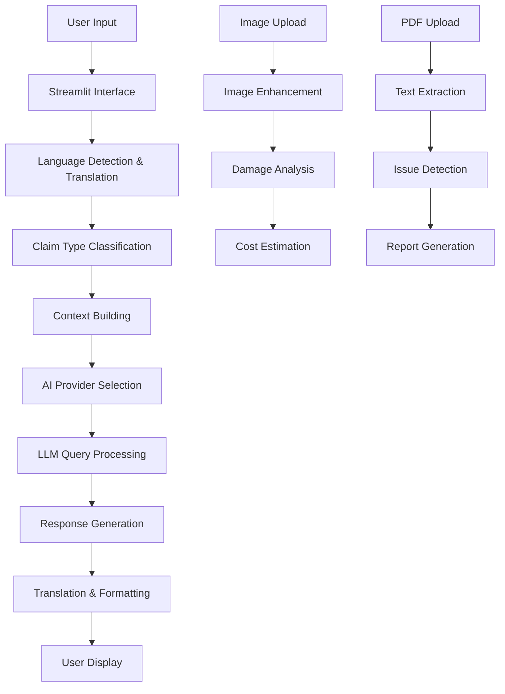

# 🛡️ InsuranceSaathi - AI-Powered Insurance Claim Assistant

**InsuranceSaathi** is a comprehensive AI-powered insurance claim assistant that helps users navigate through complex insurance claim processes. The application supports Vehicle, Health, and Home insurance claims with multilingual support (English/Hindi) and integrates with multiple AI providers for intelligent assistance.

## 🌟 Features

### 🔍 **Multi-Modal Analysis**
- **Image Processing**: Upload damage photos for automatic analysis and cost estimation
- **Document Processing**: PDF analysis for health insurance documents with issue detection
- **Damage Assessment**: AI-powered damage level detection (severe, moderate, minor, minimal)

### 🤖 **AI Integration**
- **Multiple LLM Providers**: Ollama (local), Groq, Google Gemini, HuggingFace
- **Intelligent Responses**: Context-aware answers based on claim type and scenario
- **Fallback System**: Comprehensive default responses when AI services are unavailable

### 🌐 **Multilingual Support**
- **Languages**: English and Hindi
- **Smart Translation**: Cached translation system for better performance
- **Localized Content**: Insurance terminology and processes in local context

### 📋 **Insurance Claim Types**
- **Vehicle Insurance**: Accident claims, damage assessment, required documents
- **Health Insurance**: Medical bills analysis, cashless vs reimbursement guidance
- **Home Insurance**: Property damage, theft claims, liability coverage

### 💡 **Smart Features**
- **Cost Estimation**: Automated repair cost calculation based on damage analysis
- **Document Checklist**: Dynamic required documents list based on claim type
- **Timeline Guidance**: Expected processing times and important deadlines
- **Quick Actions**: Pre-defined buttons for common insurance questions

## 🛠️ Installation & Setup

### Prerequisites
- Python 3.8 or higher
- pip (Python package installer)
- Git

### 1. Clone the Repository
```bash
git clone https://github.com/yourusername/insurance-saathi.git
cd insurance-saathi
```

### 2. Create Virtual Environment
```bash
# Create virtual environment
python -m venv insurance_env

# Activate virtual environment
# On Windows:
insurance_env\Scripts\activate
# On macOS/Linux:
source insurance_env/bin/activate
```

### 3. Install Dependencies
```bash
pip install -r requirements.txt
```

### 4. Required Python Packages
Create a `requirements.txt` file with the following packages:
```txt
streamlit>=1.28.0
streamlit-chat>=0.1.1
PyMuPDF>=1.23.0
Pillow>=10.0.0
opencv-python>=4.8.0
numpy>=1.24.0
googletrans==4.0.0rc1
python-dotenv>=1.0.0
requests>=2.31.0
```

### 5. Environment Configuration

Create a `.env` file in the project root directory:
```env
# API Keys (Optional - get from respective providers)
HUGGINGFACEHUB_API_TOKEN=your_huggingface_token_here
GEMINI_API_KEY=your_gemini_api_key_here
GROQ_API_KEY=your_groq_api_key_here

# Ollama Configuration (if using local Ollama)
OLLAMA_API_URL=http://localhost:11434
```

### 6. Set Up AI Providers (Choose One or More)

#### Option A: Ollama (Local AI - Recommended)
```bash
# Install Ollama
# Visit: https://ollama.ai/download

# Pull the phi3 model
ollama pull phi3

# Start Ollama server
ollama serve
```

#### Option B: Groq (Cloud AI)
1. Visit [Groq Console](https://console.groq.com/)
2. Create account and get API key
3. Add to `.env` file

#### Option C: Google Gemini (Cloud AI)
1. Visit [Google AI Studio](https://makersuite.google.com/)
2. Create project and get API key
3. Add to `.env` file

#### Option D: HuggingFace (Cloud AI)
1. Visit [HuggingFace](https://huggingface.co/)
2. Create account and get token
3. Add to `.env` file

## 🚀 Running the Application

### Start the Application
```bash
streamlit run insurance_claim_assistant.py
```

### Access the Application
- Open your web browser
- Navigate to `http://localhost:8501`
- The application should load with the InsuranceSaathi interface

## 📖 Usage Guide

### 1. **Configure Settings**
- **Language**: Choose between English and Hindi
- **AI Provider**: Select your preferred AI service
- **Claim Type**: Choose Vehicle, Health, or Home insurance

### 2. **Describe Your Situation**
- Enter detailed description of your insurance claim scenario
- Be specific about the incident, damage, or medical condition

### 3. **Upload Supporting Files**
- **Images**: Upload photos of vehicle damage, property damage, or medical reports
- **PDFs**: Upload health insurance documents, bills, or policy documents

### 4. **Get AI Assistance**
- Ask specific questions about your claim process
- Use quick action buttons for common queries
- Review comprehensive guidance and document checklists

### 5. **Analyze Results**
- Review damage assessment and cost estimates
- Check document analysis reports
- Follow step-by-step claim process guidance

## 🔧 Troubleshooting

### Common Issues and Solutions

#### 1. **Ollama Connection Issues**
```bash
# Check if Ollama is running
curl http://localhost:11434/api/tags

# Start Ollama service
ollama serve

# Verify phi3 model is installed
ollama list
```

#### 2. **API Key Issues**
- Verify API keys are correctly set in `.env` file
- Check API key validity on respective provider websites
- Ensure no extra spaces or quotes in API keys

#### 3. **Import Errors**
```bash
# Reinstall dependencies
pip install --upgrade -r requirements.txt

# For OpenCV issues on Linux:
sudo apt-get update
sudo apt-get install python3-opencv

# For Windows OpenCV issues:
pip install opencv-python-headless
```

#### 4. **Translation Issues**
```bash
# If Google Translate fails:
pip install --upgrade googletrans==4.0.0rc1

# Alternative: Use offline translation
# Set lang="en" to disable translation
```

#### 5. **Memory Issues**
- Close other applications to free up RAM
- Use smaller AI models if available
- Reduce image resolution before upload

### Debug Mode
The application includes a debug panel that shows:
- API key status for all providers
- Ollama connection test
- Error messages and logs
- Provider response status

## 📁 Project Structure

```
insurance-saathi/
│
├── insurance_claim_assistant.py    # Main application file
├── requirements.txt                # Python dependencies
├── .env                           # Environment variables (create this)
├── README.md                      # This file
 
```

## 🧠 How It Works

### Architecture Overview



### Core Components

1. **InsuranceTranslator**: Handles multilingual support with caching
2. **Image Processing**: OpenCV-based damage analysis and enhancement
3. **HealthAgent**: PDF processing and medical document analysis
4. **LLM Integration**: Multi-provider AI service integration
5. **UI Components**: Streamlit-based responsive interface

### AI Integration Flow

1. **System Message Generation**: Creates context-aware prompts based on claim type
2. **Provider Selection**: Chooses best available AI provider
3. **Retry Logic**: Implements fallback mechanism across providers
4. **Response Processing**: Formats and translates AI responses
5. **Fallback Responses**: Provides comprehensive default answers

## 🔐 Security & Privacy

### Data Handling
- **No Data Storage**: Application doesn't store user data permanently
- **Session-Based**: All data cleared when session ends
- **Local Processing**: Images processed locally when possible
- **API Security**: Secure API key management through environment variables

### Privacy Features
- **Temporary Files**: Uploaded files processed in memory only
- **No Logging**: Sensitive information not logged to files
- **Encrypted Connections**: All API calls use HTTPS
- **Optional Services**: Users can choose local AI (Ollama) for complete privacy


## 📄 License

This project is licensed under the MIT License - see the [LICENSE](LICENSE) file for details.

## 🙏 Acknowledgments

- **Streamlit**: For the amazing web framework
- **OpenCV**: For image processing capabilities
- **Google Translate**: For multilingual support
- **AI Providers**: Ollama, Groq, Google, HuggingFace for AI services
- **Open Source Community**: For various Python libraries used

### FAQ

**Q: Which AI provider is best?**
A: Ollama is recommended for privacy and speed. Groq for cloud-based performance.

**Q: Can I use this without internet?**
A: Yes, with Ollama running locally, you can use most features offline.

**Q: Is my data secure?**
A: Yes, no data is stored permanently. Use Ollama for complete privacy.

**Q: Can I add more languages?**
A: Yes, the translation system is extensible. Contributions welcome!

**Q: Does it work on mobile?**
A: The Streamlit interface is responsive and works on mobile browsers.

---

**InsuranceSaathi** - Making insurance claims simple and accessible for everyone! 🛡️✨
